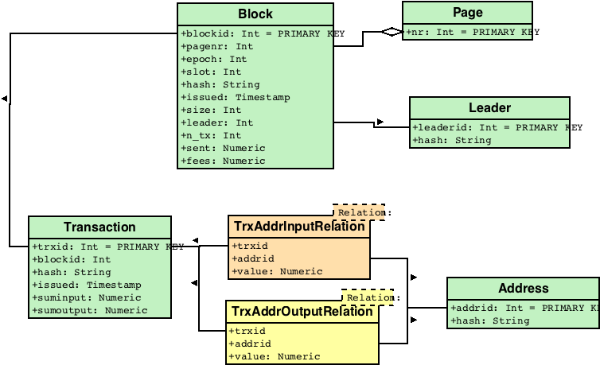

# db schema



[Postgres SQL schema](bc2sql001.sql)

table [magnitude](table_magnitude.sql) is used in some queries.

a user `bc2sql` needs to be created. this user has readonly access. the Haskell programs will connect using this role to query the database.

``` sql
CREATE ROLE bc2sql LOGIN
  NOSUPERUSER INHERIT NOCREATEDB NOCREATEROLE NOREPLICATION;
```


# data gathering

## block -> transactions

```sh
./block_txs.sh <block hash>
```

## transaction -> inputs, outputs

```sh
./txs_summary.sh <trx hash>
```

## pages of 10 blocks

### get the number of pages in the blockchain

```sh
./npages.sh
```

### get 10 blocks for a page

```sh
./get_page.sh <page #>
```

### a whole range

```sh
. colors.sh; for P in `seq 85002 86999`; do prtBlue "${P}  "; ./get_page.sh ${P} | psql -q -d bc2sql001 --; done
```

# queries

`<tbd>`


# data validation

Aside from `foreign keys` setup in the db schema, we can validate input data at the block and transaction level:

## blocks per page: 10

we know that each page reports on 10 blocks.

```
-- verify page has 10 blocks
-- outputs the pagenr which do not 
SELECT COUNT(*) as n_blocks, pagenr
FROM block
WHERE pagenr > 0
GROUP BY pagenr
HAVING COUNT(*) != 10;
```
this query can be run from the file [](verify_pages.hs)

## number of transactions matches count in blocks

```
-- count number of transactions per block
-- and compare to field 'n_tx'
SELECT * FROM
  (SELECT blockid, n_tx FROM block) AS t1
JOIN 
  (SELECT COUNT(*) as n_trxs, blockid
   FROM transaction
   GROUP BY transaction.blockid) AS t2
ON
  t1.blockid = t2.blockid
  WHERE t1.n_tx != t2.n_trxs;
```

## sum of transaction details equal to reported sums

<tbd>

# Haskell implementation

## get block transactions

```
./show_block.hs 27b0471fa372485ae569a3657f6c9a0b8d6c36874f3aaa6a2c4e7147befbe2c0
```

